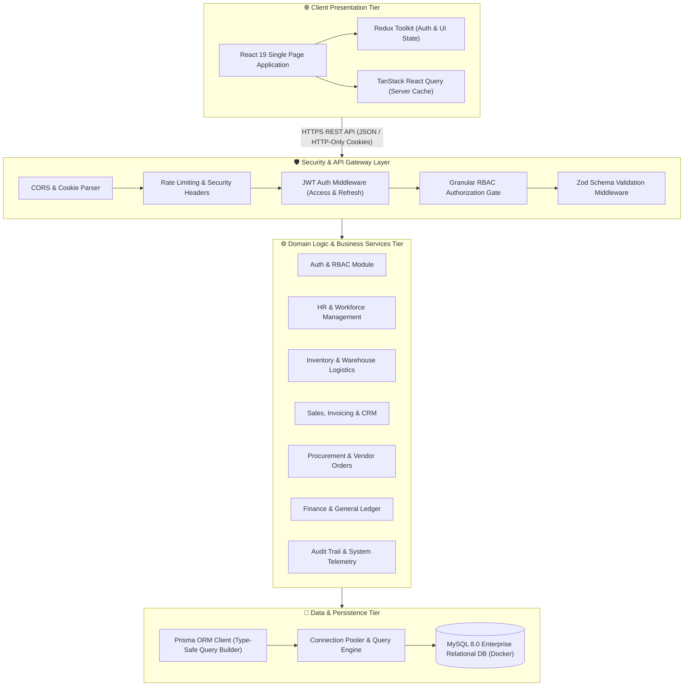
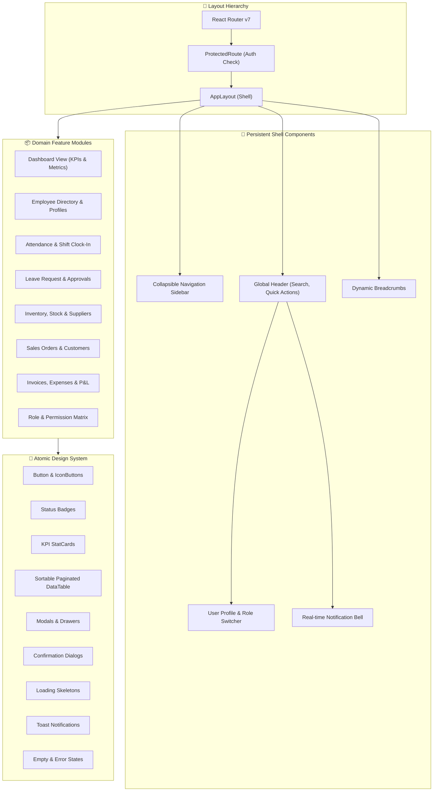
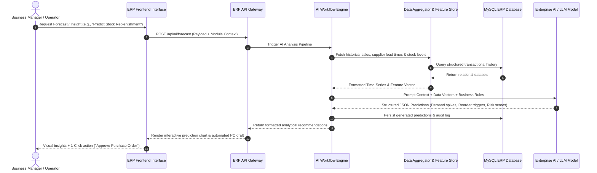

# 🏢 Modern Enterprise Resource Planning (ERP) System

A robust, enterprise-grade, full-stack ERP platform engineered to unify and streamline core business operations—including **Human Resource Management (HRMS)**, **Inventory & Warehouse Operations**, **Sales & Order Management**, **Procurement & Vendor Logistics**, **Finance & Accounting**, and **Real-Time Predictive Analytics**.

---

## 📑 Table of Contents
1. [System Design Architecture](#-system-design-architecture)
2. [Tech Stack](#-tech-stack)
3. [UI Architecture & Frontend Design System](#-ui-architecture--frontend-design-system)
4. [AI Workflow & Intelligent Automation Engine](#-ai-workflow--intelligent-automation-engine)
5. [Core Business Modules](#-core-business-modules)
6. [Granular Role-Based Access Control (RBAC)](#-granular-role-based-access-control-rbac)
7. [Getting Started & Local Setup](#-getting-started--local-setup)
8. [Demo User Credentials](#-demo-user-credentials)
9. [How to Present This Project (Step-by-Step)](#-how-to-present-this-project-step-by-step)
10. [Implementation Log](#-implementation-log)

---

## 🏛 System Design Architecture

The ERP platform is architected as a **High-Performance Modular Monolith** adhering to strict **N-Tier Layered Architecture** and **Domain-Driven Design (DDD)** principles. This ensures maximum decoupling across modules, strict type safety, data integrity, and horizontal scalability.

### High-Level Architectural Diagram



### Layered Backend Processing Pipeline

Each incoming request passes through an isolated, deterministic execution pipeline:

```
HTTP Request 
   ├── 1. Global Error & Logging Middleware
   ├── 2. JWT Verification (Access Token Validation & Refresh Rotation)
   ├── 3. Permission Gate (Verifies user permissions against module requirement)
   ├── 4. Zod Request Parser (Validates body, query parameters, and headers)
   ├── 5. Domain Controller (Extracts context, delegates to business services)
   ├── 6. Service Layer (Executes business rules, calculations, and domain logic)
   ├── 7. Prisma Data Access Layer (Executes atomic ACID transactions & queries)
   └── 8. Standardized JSON Response (Enforces consistent HTTP envelope structure)
```

---

## 🛠 Tech Stack

### 🚀 Backend
- **Runtime & Language**: [Node.js](https://nodejs.org/) (v18+) with [TypeScript](https://www.typescriptlang.org/) (Strict Type Checking)
- **Web Framework**: [Express 5](https://expressjs.com/) (Modular Router & Controller Architecture)
- **Database ORM**: [Prisma ORM 6](https://www.prisma.io/) (Type-safe schema modeling, migrations, and transactional client)
- **Schema Validation**: [Zod](https://zod.dev/) (Runtime static schema inference and deep request validation)
- **Security & Cryptography**: [Bcrypt.js](https://github.com/dcodeIO/bcrypt.js) (Password hashing with salted rounds), [JSONWebToken](https://jwt.io/) (Dual-token pattern: Access + Refresh)
- **Execution & Dev Tools**: [TSX](https://github.com/privatenumber/tsx) (TypeScript execution and hot module watching)

### 🎨 Frontend
- **Library & Bundler**: [React 19](https://react.dev/) + [Vite 8](https://vitejs.dev/) (Ultra-fast HMR and optimized production bundling)
- **Language**: [TypeScript](https://www.typescriptlang.org/)
- **State Management**: [Redux Toolkit](https://redux-toolkit.js.org/) (Global auth session, notifications, UI theme) + [TanStack Query v5](https://tanstack.com/query/latest) (Server state caching, optimistic updates, query invalidation)
- **Routing**: [React Router DOM v7](https://reactrouter.com/) (Nested layouts, protected routes, permission guards)
- **Form Management**: [React Hook Form](https://react-hook-form.com/) with `@hookform/resolvers/zod`
- **Styling & UI Components**: [TailwindCSS v4](https://tailwindcss.com/), [Lucide React Icons](https://lucide.dev/), [Recharts](https://recharts.org/) (Interactive data visualizations)

### 🗄 Database & DevOps
- **Relational Database**: [MySQL 8.0](https://www.mysql.com/) (ACID-compliant storage, relational foreign keys, indexed queries)
- **Containerization**: [Docker](https://www.docker.com/) & [Docker Compose](https://docs.docker.com/compose/) (Isolated database service on port `3307`)
- **Linting & Code Quality**: [Oxlint](https://oxc.rs/) for high-speed static code analysis

---

## 💻 UI Architecture & Frontend Design System

The frontend is structured around a component-driven, modular UI hierarchy ensuring high reusability, snappy client-side navigation, and enterprise UX standards.



### UI Architectural Highlights
1. **Client-Side Permission Gating (`<PermissionGate />`)**: 
   Components and action buttons (e.g. *Edit Employee*, *Approve Leave*, *Issue Invoice*) automatically show, disable, or hide based on the active user's permissions array in Redux state.
2. **Optimistic UI & Cache Synchronization**:
   Data mutations trigger instant optimistic UI updates via TanStack Query, with automatic background rollback if server validation fails.
3. **Responsive Glassmorphism & Modern Styling**:
   Crafted with dark/light tone harmony, smooth micro-interactions, responsive sidebars, accessible form controls, and responsive data tables.

---

## 🤖 AI Workflow & Intelligent Automation Engine

The ERP incorporates an intelligent AI Workflow designed to assist managers and operators in decision making, risk mitigation, and automated operational forecasting.



### Key AI Workflows Supported:
1. **Predictive Inventory Replenishment**:
   - Analyzes historical order velocity, seasonal trends, and supplier lead times to calculate optimal reorder points before items go out of stock.
2. **Smart HR & Attrition Risk Scoring**:
   - Evaluates attendance trends, leave patterns, and tenure metrics to identify burnout risks and recommend shift balance optimizations.
3. **Automated Expense & Invoice Categorization**:
   - Uses NLP pattern matching to auto-categorize incoming procurement receipts and match supplier invoices against open Purchase Orders.
4. **Natural Language Executive Assistant**:
   - Allows executives to query business status in plain English (e.g., *"What is our net revenue and top 3 expense categories this month?"*) and receives summarized metrics with chart visualizations.

---

## 🏢 Core Business Modules

| Module | Core Functionality | Entities Managed |
| :--- | :--- | :--- |
| **HR & Workforce** | Employee directory, designations, compensation tracking, attendance check-in, leave approval cycles | `Employee`, `Department`, `Designation`, `Attendance`, `LeaveRequest` |
| **Inventory & SCM** | Real-time stock levels, SKU management, stock in/out movement ledger, low-stock threshold triggers | `Product`, `Category`, `Supplier`, `StockMovement` |
| **Sales & CRM** | Customer directory, quote-to-order workflow, invoice generation, fulfillment status tracking | `Customer`, `SalesOrder`, `OrderItem`, `Invoice` |
| **Procurement** | Supplier catalogs, Purchase Orders (PO), delivery confirmation, goods receipt ledger | `PurchaseOrder`, `Supplier`, `StockMovement` |
| **Finance & Accounts** | Revenue ledger, expense filing, vendor payout tracking, profit & loss summaries | `Invoice`, `Expense`, `PaymentRecord` |
| **Audit & Governance**| Immutable event logging for compliance, user activity tracking, IP & timestamp recording | `AuditLog`, `Notification` |

---

## 🔐 Granular Role-Based Access Control (RBAC)

Access permissions are decoupled from static roles and structured as dynamic claims:

```
User ──(has one)──> Role ──(has many)──> RolePermission ──(points to)──> Permission
```

### Pre-Seeded Roles & Capabilities:
- **`SUPER_ADMIN`**: Unrestricted master access across all modules, configuration, and tenant settings.
- **`ADMIN`**: Enterprise administrator managing user profiles, operations, and business reports.
- **`HR_MANAGER`**: Full HR authority (Employee directory, Department structure, Attendance logs, Leave approvals).
- **`INVENTORY_MANAGER`**: Authority over products, warehouse stock adjustments, supplier profiles, and procurement.
- **`SALES_MANAGER`**: Authority over customer records, order lifecycle, sales analytics, and invoice dispatching.
- **`ACCOUNTANT`**: Authority over invoices, payment verification, expense approvals, and financial ledger audits.
- **`EMPLOYEE`**: Self-service portal for personal profile, daily attendance check-in, and leave submission.

---

## 🚀 Getting Started & Local Setup

### 1. Prerequisites
- [Node.js](https://nodejs.org/) (v18.0 or later)
- [Docker Desktop](https://www.docker.com/) (for containerized MySQL)
- [Git](https://git-scm.com/)

### 2. Clone Repository
```bash
git clone https://github.com/chandan-0416/ERP-System.git
cd ERP-System
```

### 3. Start MySQL Container
```bash
docker compose up -d
```
*Runs MySQL 8.0 mapped on port `3307` with preconfigured database `erp_db`.*

### 4. Configure & Start Backend
```bash
cd backend
npm install
cp .env.example .env    # Verify database connection string
npx prisma migrate deploy
npm run seed             # Seeds all roles, permissions, and demo data
npm run dev
```
*Backend API will run at `http://localhost:5000` (Health check: `http://localhost:5000/api/health`).*

### 5. Configure & Start Frontend
In a separate terminal:
```bash
cd frontend
npm install
npm run dev
```
*Frontend will run at `http://localhost:5173`.*

---

## 🔑 Demo User Credentials

All standard accounts use password: **`Password123!`** (Super Admin uses **`AdminPassword123!`**):

| Role | Email | Password | Access Scope |
|---|---|---|---|
| **Super Admin** | `admin@erp.com` | `AdminPassword123!` | Full System Control, User & Role Management |
| **HR Manager** | `hr@erp.com` | `Password123!` | Employees, Departments, Attendance, Leaves |
| **Inventory Manager** | `inventory@erp.com` | `Password123!` | Products, Stock Levels, Suppliers |
| **Sales Manager** | `sales@erp.com` | `Password123!` | Customers, Orders, Invoices |
| **Accountant** | `accountant@erp.com` | `Password123!` | Invoices, Expenses, Financial Reports |
| **Employee** | `employee@erp.com` | `Password123!` | Personal Profile, Leave Requests, Attendance |

---

## 🎤 How to Present This Project (Step-by-Step)

When showcasing this ERP project in demos or technical interviews, use this 5-stage narrative:

1. **The Business Problem**: Explain how small-to-medium businesses suffer from disjointed tools (spreadsheets for stock, separate HR software, disparate invoicing tools) leading to data inconsistency.
2. **System Design & Layering**: Highlight the modular monolith architecture, Zod validation layer, and Prisma relational modeling ensuring type-safety from database to frontend UI.
3. **Security & RBAC Enforcement**: Show how dual JWT tokens (short-lived access + secure refresh) and fine-grained permission matrices protect sensitive HR and financial operations.
4. **Frontend Architecture & UX**: Walk through the dynamic React 19 UI, reusable design system, optimistic state updates with TanStack Query, and client-side permission gating.
5. **AI Workflow & Business Intelligence**: Demonstrate the predictive stock replenishment and automated intelligence workflows that transform raw ERP transaction logs into actionable business insights.

---

## 📝 Implementation Log

- [x] Initialized monorepo with backend Express 5, frontend React 19 / Vite, and Docker Compose MySQL.
- [x] Designed normalized Prisma relational schema with 18+ models and cascading constraints.
- [x] Implemented dual JWT authentication, refresh token rotation, and granular RBAC permission middleware.
- [x] Created modular domain services for Auth, HR, Inventory, Sales, Procurement, and Finance.
- [x] Built enterprise database seeder with realistic demo records, roles, and fine-grained permissions.
- [x] Designed frontend layout shell with header, sidebar, dynamic breadcrumbs, and notification drawers.
- [x] Implemented atomic design system components (StatCard, DataTable, Modal, Badges, Toast notifications).
- [x] Documented System Design Architecture, Tech Stack, UI Architecture, and AI Workflow in README.
